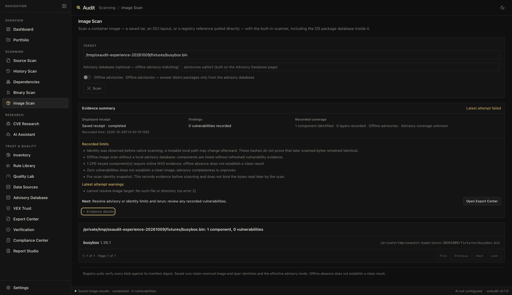

# Alert quality and result evidence validation — 2026-10-09

This change reduces alerts for proven constant Java local values and makes scan
results easier to assess across Source, Dependencies, Binary, Image and History.
It preserves uncertain inputs and distinguishes the latest attempt from the
saved receipt being displayed.

## Detection changes and external evidence

The bounded Java pass models immutable `int`, `boolean` and `String` locals,
sequential overwrites, constant arithmetic/conditions, ternaries and branch
joins. Java integer arithmetic wraps at 32 bits. Formal parameters retain their
existing origin classification without an unnecessary local proof. Unknown
helpers, mutable fields/collections, interpolation, unsupported control paths,
incomplete syntax and exhausted budgets cannot establish a safe value.
The proof is capped at 4,096 steps, 32 levels and 128 locals.

[Before/after receipts](../benchmarks/results/alert-quality-2026-10-09.json)
record the actual CLI checksums, dirty working-tree provenance, command
elapsed time/RSS and every category's confusion matrix. Both runs read the
same clean OWASP BenchmarkJava checkout at
`550021e915c06cbcf994d97bc258128b78d890db`, with evaluator `owasp-java-cwe-v1`
and expected-results SHA-256
`1809f6a690c6cf7dd6685df6ebe2eef8fe3ca93d19a7ca0ce45987ca4f5d78e1`.
No external fixture, label, evaluator or threshold was changed; OWASP code was
not built, installed or executed.

| Metric on the same 2,740 labelled cases | Before | After |
| --- | --- | --- |
| True positives | 1,346 | 1,346 |
| False positives | 724 | 689 |
| True negatives | 601 | 636 |
| False negatives | 69 | 69 |
| Precision | 65.02% | 66.14% |
| Recall | 95.12% | 95.12% |
| False positive rate | 54.64% | 52.00% |

Every category retained its exact true-positive and false-negative counts, and
none added a false positive. Existing category gates passed before the baseline
was refreshed; thresholds were retained. The 35 fewer false alerts are a 4.83%
reduction in this benchmark's false positives, not a general real-world rate.

| Category | False positives before → after | True positives retained | False negatives retained |
| --- | --- | --- | --- |
| cmdi | 125 → 125 | 126 | 0 |
| crypto | 0 → 0 | 130 | 0 |
| hash | 0 → 0 | 129 | 0 |
| ldapi | 32 → 31 | 27 | 0 |
| pathtraver | 114 → 112 | 123 | 10 |
| securecookie | 0 → 0 | 36 | 0 |
| sqli | 232 → 212 | 272 | 0 |
| trustbound | 16 → 14 | 33 | 50 |
| weakrand | 0 → 0 | 218 | 0 |
| xpathi | 20 → 16 | 15 | 0 |
| xss | 185 → 179 | 237 | 9 |

Rule coverage exists for all eleven categories; this does not establish complete
analysis. Command-injection false positives did not improve on OWASP, despite
new authored command-overwrite regressions. Unknown helper-returning calls
remain conservative, and this is not a full interprocedural taint analyzer.

## Result experience

A shared summary presents operation state, the displayed receipt's state and
recorded time, findings, actual recorded scope/unknown coverage, real limits and
a useful next action. General limitations, IDs, hashes, layers and logs expand
through a button supporting Enter/Space and exposing `aria-expanded`.

Newer attempt warnings are labelled separately from the displayed receipt's
limits. Retry/recovery state is cleared or rebound when newer evidence arrives;
Binary notes stay attached to the receipt that produced them. Incomplete Source
receipts no longer imply a completed lifecycle, including while a replacement
runs or after cancellation. Empty History results say no findings recorded.
Existing review, upgrade decisions, paging, cancellation ownership and exact
saved-run export handoff remain covered by regressions.

The real Chrome check used an isolated loopback server with owned inert fixtures.
Source showed one recorded finding, one covered file and one skipped file.
Image showed a failed latest attempt alongside an older completed receipt,
unknown advisory coverage and the recorded offline limits. Enter opened details,
Space collapsed them, and Enter on Open Export Center selected the exact
completed receipt `run_54746b80-2818-47e4-a7c2-b7621e08d740`, rather than the
newer failed receipt. The temporary server and browser tab were closed.

This is a focused desktop Chrome check, not a screen-reader audit, a responsive
breakpoint audit or participant acceptance. Other page states are covered by
component integration tests. No external pilot observations were invented.

## Verification

| Check | Result |
| --- | --- |
| Rust workspace, all features | 1,368 passed; one existing ignored test |
| Strict workspace/all-targets/all-features Clippy | Passed |
| Rust formatting and diff whitespace | Passed |
| Frontend/tooling | 167 Node tests and 320 Vitest tests passed |
| TypeScript and production frontend build | Passed |
| Consumer CI shell contracts using actual final CLI | 10 passed; none skipped |
| Reduced server builds with no grammars and core grammars | Passed |
| Authored corpus | 234 fixtures, 116 TP, 0 FP, 0 FN |
| Pinned external category gates | All eleven passed; no new misses |
| Four actual CLI performance workloads | All population/identity checks passed |

The seven new corpus fixtures cover constant SQL/LDAP/XPath/command cases and
unsafe overflow, mutable-index and interpolated inputs. RED/GREEN scanner and
page regressions were observed. Additional tests guard unequal boolean joins,
exhausted local/step budgets, invalid parameter redeclarations and Java request
origin. Sixteen page behavior tests cover save/coverage states, exact export,
retry/recovery, cancelled replacement, incomplete lifecycle and legacy metadata.
The authored corpus remains regression evidence, not independent effectiveness.

## Measured resource tradeoff

Both quality measurements used macOS arm64 debug CLIs with default grammars and
the server feature. The final measurements use a preserved copy of the executable
so subsequent Cargo validation cannot replace the bytes being measured. Sequential local observations without concurrent project
validation measured whole-CLI time **12.933 → 15.661 seconds**, internal scoring
**12.874 → 14.174 seconds**, and maximum command RSS
**47,349,760 → 47,677,440 bytes**. The parameter fast path avoids needless local
interpretation; the added proof still costs CPU. These single observations do
not establish a stable budget or a speed improvement.

[The final owned performance receipt](../benchmarks/performance/alert-quality-debug-2026-10-09.json)
records the exact final CLI and deterministic inert fixture hashes. Its samples
are separate from the external Java timing:

| Workload | Required population retained | Elapsed | Maximum command RSS |
| --- | --- | --- | --- |
| Source/findings | 128 files, 2,048 findings | 985.345 ms | 112,967,680 bytes |
| Nested archive | 1,000 packages | 268.455 ms | 42,631,168 bytes |
| Saved image | 1,000 packages, one layer | 268.852 ms | 42,434,560 bytes |
| Dependency cache | 2,000 package queries | 219.496 ms | 45,236,224 bytes |

Native cases measure offline inventory only; their zero vulnerability count is
not advisory coverage. Dependency receipts are synthetic test data. RSS is
command resource usage, not aggregate process-tree memory. These are local
single observations, not release/cross-host gates or external usability evidence.
